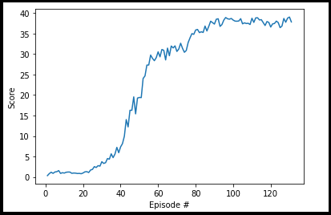

# Project 1: Navigation

### Introduction

For this project, you will work with the [Reacher](https://github.com/Unity-Technologies/ml-agents/blob/main/docs/Learning-Environment-Examples.md#reacher) environment. 


In this environment, a double-jointed arm can move to target locations. A reward of +0.1 is provided for each step that the agent's hand is in the goal location. Thus, the goal of your agent is to maintain its position at the target location for as many time steps as possible.

The observation space consists of 33 variables corresponding to position, rotation, velocity, and angular velocities of the arm. Each action is a vector with four numbers, corresponding to torque applicable to two joints. Every entry in the action vector should be a number between -1 and 1.

### Getting Started

For this project, you will not need to install Unity - this is because we have already built the environment for you, and you can download it from one of the links below. You need only select the environment that matches your operating system:

Version 2: Twenty (20) Agents
- Linux: [click here](https://s3-us-west-1.amazonaws.com/udacity-drlnd/P2/Reacher/Reacher_Linux.zip)
- Mac OSX: [click here](https://s3-us-west-1.amazonaws.com/udacity-drlnd/P2/Reacher/Reacher.app.zip)
- Windows (32-bit): [click here](https://s3-us-west-1.amazonaws.com/udacity-drlnd/P2/Reacher/Reacher_Windows_x86.zip)
- Windows (64-bit): [click here](https://s3-us-west-1.amazonaws.com/udacity-drlnd/P2/Reacher/Reacher_Windows_x86_64.zip)

Then, place the file in the p2_continuous-control/ folder in the DRLND GitHub repository, and unzip (or decompress) the file.

## Dependencies

To set up your python environment to run the code in this repository, follow the instructions below.

1. Create (and activate) a new environment with Python 3.6.

	- __Linux__ or __Mac__: 
	```bash
	conda create --name drlnd python=3.6
	source activate drlnd
	```
	- __Windows__: 
	```bash
	conda create --name drlnd python=3.6 
	activate drlnd
	```
	
2. If running in **Windows**, ensure you have the "Build Tools for Visual Studio 2019" installed from this [site](https://visualstudio.microsoft.com/downloads/).  This [article](https://towardsdatascience.com/how-to-install-openai-gym-in-a-windows-environment-338969e24d30) may also be very helpful.  This was confirmed to work in Windows 10 Home.  

3. Follow the instructions in [this repository](https://github.com/openai/gym) to perform a minimal install of OpenAI gym.  
	- Next, install the **classic control** environment group by following the instructions [here](https://github.com/openai/gym#classic-control).
	- Then, install the **box2d** environment group by following the instructions [here](https://github.com/openai/gym#box2d).
	
4. Clone the repository (if you haven't already!), and navigate to the `python/` folder.  Then, install several dependencies.  
    ```bash
    git clone https://github.com/udacity/deep-reinforcement-learning.git
    cd deep-reinforcement-learning/python
    pip install .
    ```

5. Create an [IPython kernel](http://ipython.readthedocs.io/en/stable/install/kernel_install.html) for the `drlnd` environment.    
    ```bash
    python -m ipykernel install --user --name drlnd --display-name "drlnd"
    ```

6. Before running code in a notebook, change the kernel to match the `drlnd` environment by using the drop-down `Kernel` menu.
### Instructions

Follow the instructions in `Continuous_Control.ipynb` to get started with training your own agent!  

### Training result




